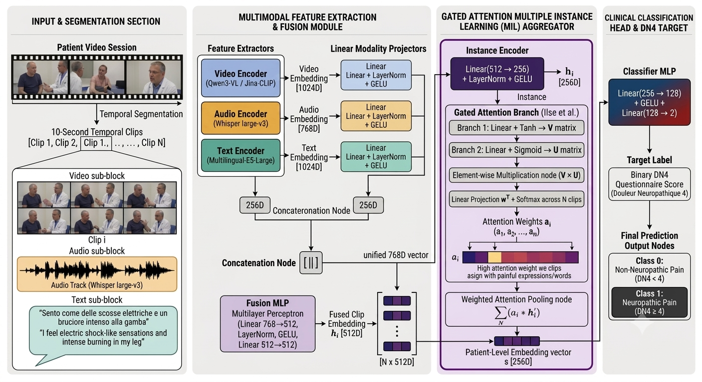

# NeuroMIL: Weakly-Supervised Multimodal Framework for Neuropathic Pain Assessment

## Authors

- **Raffaele Aurucci** — Department of Computer Science, University of Salerno — raurucci@unisa.it
- **Marco Cascella** — Department of Medicine, Surgery, and Dentistry, University of Salerno — mcascella@unisa.it
- **Stefano Cirillo** — Department of Computer Science, University of Salerno — scirillo@unisa.it
- **Ornella Piazza** — Department of Medicine, Surgery, and Dentistry, University of Salerno — opiazza@unisa.it
- **Giuseppe Polese** — Department of Computer Science, University of Salerno — gpolese@unisa.it
- **Giandomenico Solimando** — Department of Computer Science, University of Salerno — gsolimando@unisa.it

University of Salerno, Fisciano (SA), Italy

## Abstract

Neuropathic pain is a complex, debilitating condition requiring accurate clinical screening. Diagnostic assessment relying on the *Douleur Neuropathique 4* (DN4) questionnaire depends on subjective patient recall and time-consuming manual clinical evaluations. Automated assessment of neuropathic pain from clinical interviews remains challenging due to both the scarcity of publicly available datasets in the literature and the reliability of annotation procedures. In this paper, we present NEUROMIL (**NEURO**pathic pain assessment via **M**ultimodal **I**nstance **L**earning), a weakly supervised Multiple Instance Learning (MIL) framework for automated binary DN4 neuropathic pain classification. NEUROMIL segments long patient interviews into temporal clips, extracting deep representations using Jina-CLIP-v2 for video frames, Whisper large-v3 for raw speech audio, and Whisper ASR combined with Multilingual-E5-Large for Italian clinical speech transcripts. A Per-Clip Fusion MLP maps concatenated modality features into a joint embedding space, followed by Gated Attention MIL pooling to aggregate temporal clips into a unified patient-level representation. We validate our approach on a novel, real-world clinical dataset of Italian-speaking patients undergoing pharmacological therapy for chronic pain, with DN4 labels established by domain-expert clinicians. Results show that the combination of vocal acoustics with clinical speech achieves an accuracy of 78.13% and a Macro F1 of 76.43%, highlighting that such automated frameworks can be used as decision-support tools to assist clinicians in neuropathic pain evaluation.

## Keywords

Neuropathic Pain Assessment · Multiple Instance Learning · Multimodal Fusion · Weakly-Supervised Learning · Digital Health

## The NeuroMIL framework

<p align="center">
  
</p>

<p align="center"><i>Overview of the NeuroMIL framework: Input & Segmentation, Multimodal Feature Extraction & Fusion, Gated Attention MIL Aggregation, and the Clinical Classification Head.</i></p>

Each patient interview is treated as a **bag of unannotated 10-second temporal clips**, since only a patient-level DN4 score (never frame-level pain labels) is available for supervision. For every clip, three modalities are encoded independently — **Jina-CLIP-v2** for the sampled video frames, **Whisper large-v3** for the dense acoustic representation of the raw audio, and **Multilingual-E5-Large** for the semantic embedding of the Italian ASR transcript (also produced by Whisper large-v3). Each modality embedding is projected to a shared 256-dimensional space and concatenated, and a **Per-Clip Fusion MLP** produces a unified 512-dimensional clip representation.

A **Gated Attention MIL Aggregator** (Ilse et al., 2018) then learns, without any clip-level supervision, which temporal clips are most diagnostically relevant — e.g., assigning higher attention weight to clips containing painful expressions or words, while suppressing silent pauses or neutral small talk — and pools them into a single 256-dimensional patient-level embedding. Finally, a **Classifier MLP** maps this embedding to the binary DN4 outcome: **Class 0** (Non-Neuropathic Pain, DN4 < 4) or **Class 1** (Neuropathic Pain, DN4 ≥ 4).

The framework is evaluated through an ablation of 7 modality configurations (video/audio/text, and every union of the three) under both a fixed 80/20 patient-level train/test split and a 5-fold patient-level stratified cross-validation, always splitting at the patient level to prevent data leakage.

## Repository content

- **`configs/config.yaml`** — master configuration: paths, temporal segmentation, embedding backends, model architecture, and training hyperparameters.
- **`datasets/`** — dataset manifest construction, DN4 label processing (`label_processor.py`), and the Ruggi Hospital clinical dataset loader (`ruggi_dataset.py`).
- **`embeddings/`** — the Multimodal Feature Extraction stage: `extraction_pipeline.py` (segmentation, ASR, offline feature caching), `jina_embeddings.py` (Jina-CLIP-v2 / Whisper large-v3 / Multilingual-E5-Large backend), `qwen3vl_embeddings.py` (alternative Qwen3-VL video backend), and `base.py` (shared backend interface).
- **`models/`** — the NeuroMIL architecture: `fusion.py` (Per-Clip Multimodal Fusion), `mil_attention.py` (Gated Attention MIL Aggregator), and `classifier.py` (Classifier Head + end-to-end `PainMILModel`).
- **`training/`** — `train.py` (fixed split / cross-validation training loops) and `evaluate.py`.
- **`experiments/full_grid.py`** — runs the full (embedding backend × clinical label) grid.
- **`dn4_evaluation.py`** — reproduces the paper's two evaluation protocols (fixed 80/20 split and 5-fold CV) across all 7 modality combinations.
- **`utils/`** — checkpointing, metrics, and attention-weight visualization utilities.
- **`results/`** — CSV outputs from the paper's evaluation protocols.
- **`figure/`** — figures shown in this README.

## Getting started

The project requires **Python 3.11**, `ffmpeg`/`ffprobe` on `PATH`, and a CUDA-capable GPU is strongly recommended (Jina-CLIP-v2, Whisper large-v3, and Multilingual-E5-Large are run as offline feature extractors).

### 1. Clone the repository

```bash
git clone https://github.com/DaisLab-Unisa/NeuroMIL.git
cd NeuroMIL
```

### 2. Create and activate a virtual environment

**Windows (PowerShell):**
```powershell
py -3.11 -m venv .venv
.venv\Scripts\Activate.ps1
```

**Linux / macOS:**
```bash
python3.11 -m venv .venv
source .venv/bin/activate
```

### 3. Install dependencies

```bash
pip install --upgrade pip
pip install -r requirements.txt
```

### 4. Run the framework

Set `paths.video_dir` and `paths.clinical_csv` in `configs/config.yaml` to your local dataset, then:

```bash
# 1. Offline feature extraction (video/audio/text embeddings, cached to disk)
python -m embeddings.extraction_pipeline --config configs/config.yaml

# 2. Reproduce the paper's Table I (80/20 split) and Table II (5-fold CV)
python dn4_evaluation.py

# Alternatively, run the full backend x label grid
python -m experiments.full_grid --config configs/config.yaml
```

Due to the sensitive clinical nature of the interviews and strict privacy regulations, the video and audio data cannot be publicly released. They may be obtained upon reasonable request to the corresponding author for non-commercial research only, subject to a data-sharing agreement and institutional ethics approval.

## Reference

Please cite our work if you use it in your research:

```bibtex
@inproceedings{neuromil2026,
  title     = {NeuroMIL: Weakly-Supervised Multimodal Framework for Neuropathic Pain Assessment},
  author    = {Aurucci, Raffaele and Cascella, Marco and Cirillo, Stefano and Piazza, Ornella and Polese, Giuseppe and Solimando, Giandomenico},
  booktitle = {IEEE International Conference on E-health Networking, Application \& Services (IEEE Healthcom)},
  year      = {2026}
}
```
